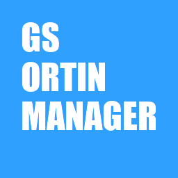

# Ortin: IS-NITRO management program

## What is ortin?

Ortin is a utility based on reverse-engineered documentation for the
Intelligent Systems IS-NITRO-EMULATOR development kit for Nintendo DS.

Portions of Ortin are based on [NitroDriver](https://github.com/Dirbaio/NitroDriver)
by Dirbaio.

## Features

* Set AV mode on all IS-NITRO-EMULATOR systems, including those that don't
  have the Video option enabled.
* Load a Nintendo DS ROM image. Both encrypted and decrypted ROM images are
  supported. (Decrypted ROM images are re-encrypted on the fly.)
* Boot Game Boy Advance cartridges by enabling Slot 2 and resetting the
  system.

## TODO

* Dumping Slot-1 and Slot-2 cartridges on the PC side.
* Dumping system firmware and BIOSes.
* Graphical interface with fancy ROM loader.
* Implement more of IS-NITRO-DEBUGGER's functionality.

## Notes

* IS-NITRO-EMULATOR systems cannot boot from Slot-1 cards directly; instead,
  a ROM image must be loaded onto the EMULATOR board, which usually has 256 MB
  RAM. This makes it impossible to load 512 MB games. Currently, there's no
  known method to detect the amount of installed RAM, so 512 MB games might
  look like they loaded, but they will likely crash once they try accessing
  data past the 256 MB limit.
* IS-NITRO-EMULATOR does *not* emulate Slot-1 save memory. Most games will
  show an error message if the save memory is not present. To work around
  this, you will need to insert a Slot-1 card with a matching save memory chip
  before loading the ROM image.

## References

* [The NSMB Hacking Domain: Nintendo DS dev hardware! IS-NITRO-EMULATOR & co.](https://nsmbhd.net/thread/4438-nintendo-ds-dev-hardware-is-nitro-emulator-and-co/)
* [GBATEK](https://problemkaputt.de/gbatek.htm) Game Boy Advance and Nintendo DS documentation
* [NitroDriver](https://github.com/Dirbaio/NitroDriver) by Dirbaio
